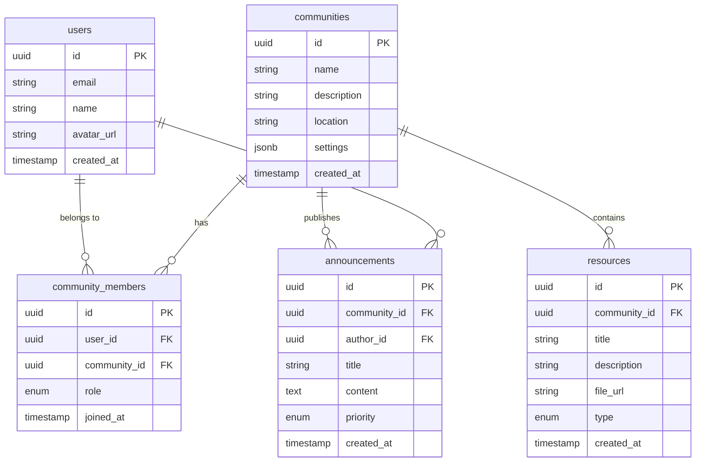

# Civil Defence Expo - Architecture Diagrams

## System Overview


## Data Flow Architecture


## Offline Sync Strategy


## Component Architecture


## Database Schema



## Security Architecture


## Deployment Architecture


## Performance Strategy

```mermaid
graph TD
    subgraph Initial Load
        IL1[Service Worker]
        IL2[Critical CSS]
        IL3[Preload Assets]
        IL4[Code Split]
    end
    
    subgraph Runtime
        RT1[Lazy Load]
        RT2[Virtual Scroll]
        RT3[Image Optimize]
        RT4[Debounce]
    end
    
    subgraph Caching
        C1[Static Assets - Forever]
        C2[API Data - 5 min]
        C3[Content - 1 hour]
        C4[User Data - Session]
    end
    
    IL1 --> RT1
    IL2 --> RT2
    IL3 --> RT3
    IL4 --> RT4
    
    RT1 --> C1
    RT2 --> C2
    RT3 --> C3
    RT4 --> C4