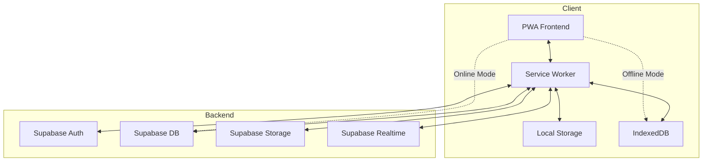
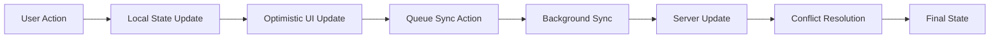
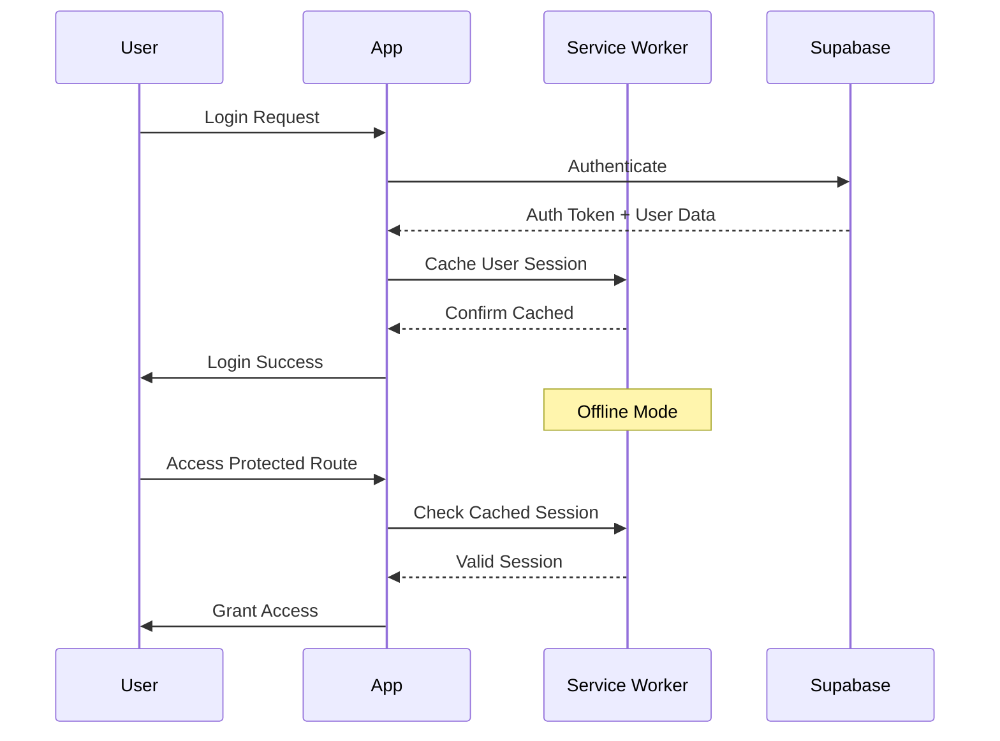

# Civil Defence Expo - System Patterns

## Architecture Overview



## Core Design Patterns

### 1. Offline-First Architecture
```typescript
// Service Worker Strategy
- Cache-first for static assets
- Network-first with cache fallback for API data
- Background sync for user actions
- Periodic sync for fresh data
```

### 2. State Management Pattern


### 3. Data Layer Architecture
```typescript
interface DataLayer {
  // Local Operations (Always Available)
  local: {
    read: () => Promise<Data>
    write: (data: Data) => Promise<void>
    delete: (id: string) => Promise<void>
  }
  
  // Remote Operations (Network Required)
  remote: {
    sync: () => Promise<SyncResult>
    fetch: () => Promise<Data>
    push: (changes: Change[]) => Promise<void>
  }
  
  // Hybrid Operations
  hybrid: {
    get: () => Promise<Data> // Local first, remote fallback
    save: (data: Data) => Promise<void> // Local save + queue sync
  }
}
```

### 4. Component Structure
```
src/
├── components/
│   ├── ui/           # ShadCN/MagicUI components
│   ├── layout/       # Layout components
│   ├── public/       # Public-facing components
│   ├── community/    # Community features
│   └── admin/        # Admin components
├── hooks/
│   ├── useOffline    # Offline detection
│   ├── useSync       # Data synchronization
│   └── useAuth       # Authentication
├── services/
│   ├── auth/         # Supabase auth wrapper
│   ├── database/     # Supabase DB operations
│   ├── storage/      # File storage
│   └── offline/      # Offline services
└── lib/
    ├── supabase/     # Supabase client config
    └── pwa/          # PWA utilities
```

### 5. Authentication Flow


### 6. Role-Based Access Control (RBAC)
```typescript
enum Role {
  PUBLIC = 'public',
  MEMBER = 'member', 
  ADMIN = 'admin'
}

interface Permission {
  resource: string
  action: 'read' | 'write' | 'delete' | 'admin'
  condition?: (user: User, resource: any) => boolean
}

// Route Protection Pattern
const protectedRoute = withAuth(
  withRole([Role.MEMBER, Role.ADMIN],
    YourComponent
  )
)

// Resource Protection Pattern
const canEdit = hasPermission(user, {
  resource: 'community',
  action: 'write',
  condition: (user, community) => 
    user.role === Role.ADMIN || 
    community.admins.includes(user.id)
})
```

### 7. Data Sync Strategy
```typescript
// Conflict Resolution
interface SyncStrategy {
  // Last Write Wins
  lastWriteWins: (local: Data, remote: Data) => Data
  
  // Client Wins
  clientWins: (local: Data, remote: Data) => Data
  
  // Server Wins  
  serverWins: (local: Data, remote: Data) => Data
  
  // Manual Resolution
  manual: (local: Data, remote: Data) => Promise<Data>
}

// Sync Queue Pattern
interface SyncQueue {
  add: (action: Action) => void
  process: () => Promise<void>
  retry: (failed: Action[]) => void
  clear: () => void
}
```

### 8. Caching Strategy
```typescript
// Cache Layers
const cacheStrategy = {
  // Static Assets - Cache Forever
  static: {
    pattern: /\.(js|css|png|jpg|woff2)$/,
    strategy: 'cache-first',
    expire: null
  },
  
  // API Data - Network First
  api: {
    pattern: /\/api\//,
    strategy: 'network-first',
    expire: 5 * 60 * 1000 // 5 minutes
  },
  
  // Public Content - Stale While Revalidate
  content: {
    pattern: /\/content\//,
    strategy: 'stale-while-revalidate',
    expire: 60 * 60 * 1000 // 1 hour
  }
}
```

### 9. Performance Patterns
- Lazy loading for non-critical features
- Code splitting by route
- Image optimization and lazy loading
- Virtual scrolling for large lists
- Debounced search and filtering
- Optimistic UI updates

### 10. Security Patterns
- Row Level Security (RLS) in Supabase
- JWT token validation
- HTTPS everywhere
- Content Security Policy (CSP)
- Input sanitization
- Rate limiting on API calls

## Critical Implementation Paths

### 1. Initial Load Performance
1. Service worker registration
2. Critical CSS inline
3. Preload key resources
4. Progressive enhancement

### 2. Offline Transition
1. Detect connection loss
2. Switch to local data
3. Queue user actions
4. Show offline indicator
5. Prepare for resync

### 3. Community Creation Flow
1. Validate user permissions
2. Create community in DB
3. Set up RLS policies
4. Initialize admin role
5. Create default resources